# Pyspark Installation

## Step 1
### find the python.exe path: 

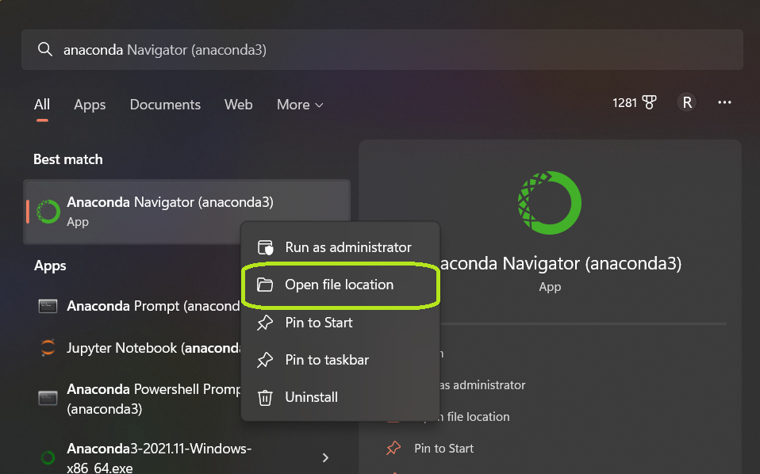

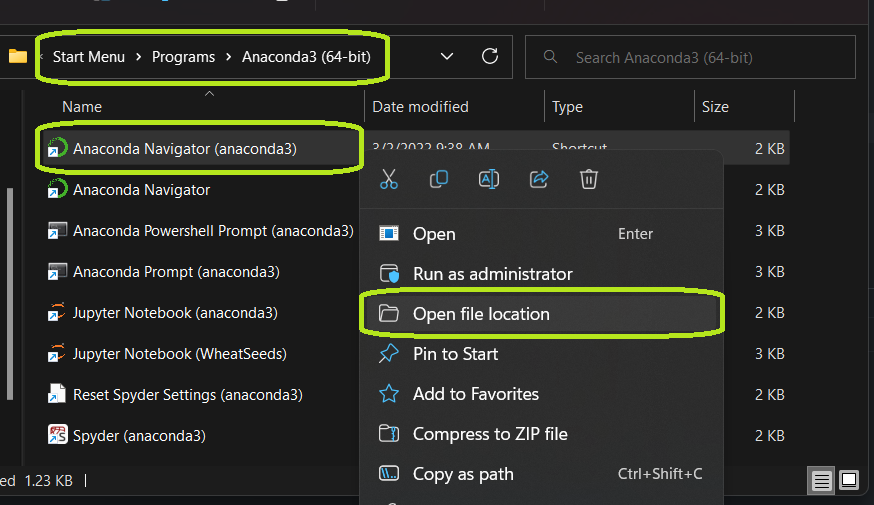

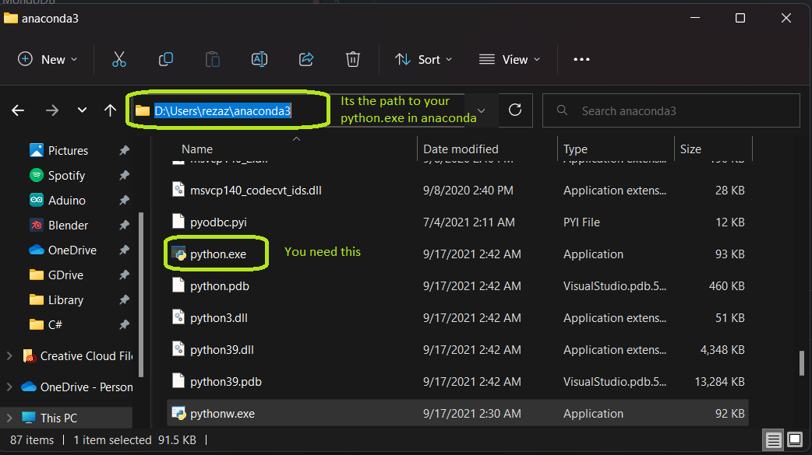

## Step 2
### Create environment variable `PYSPARK_PYTHON`

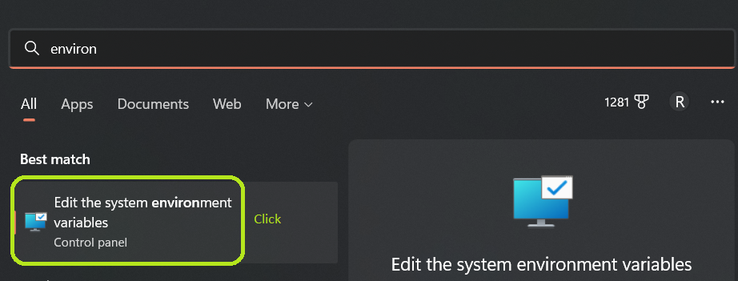

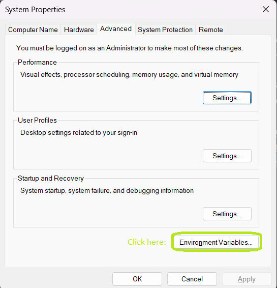

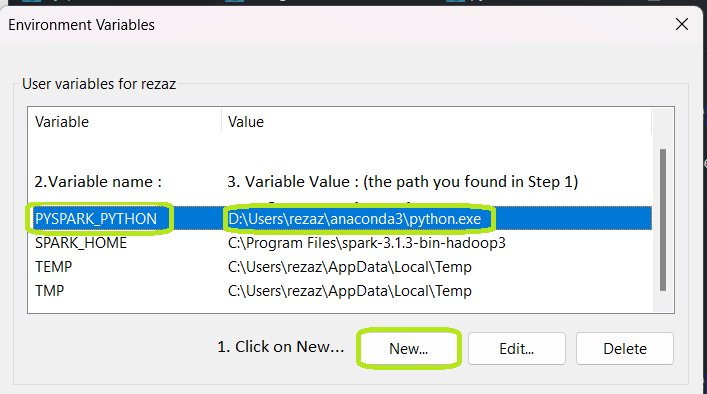

Done Click OK.

## Step 3

### Download JAVA JDK 

go to the following link and download java jdk for your OS: 

https://www.techspot.com/downloads/5553-java-jdk.html

### Install JAVA JDK 

Install the downloaded file `jdk-11.0.15.1_windows-x64_bin.exe`

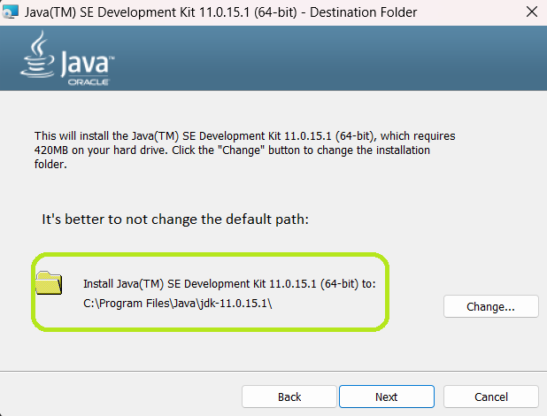

## Step 4
### Create environment variable `JAVA_HOME`

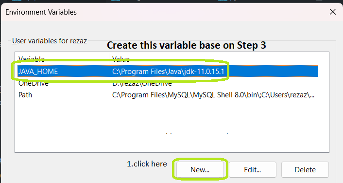

## Step 5

### Close jupyter notebook if it is open. 
### Now Open jupyter notebook and make sure every things fine. 

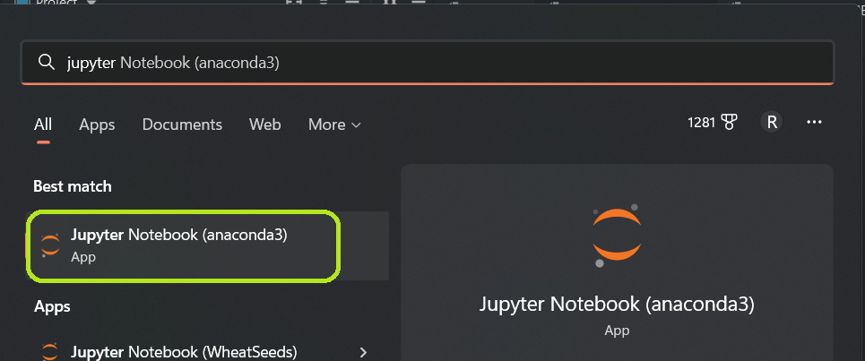

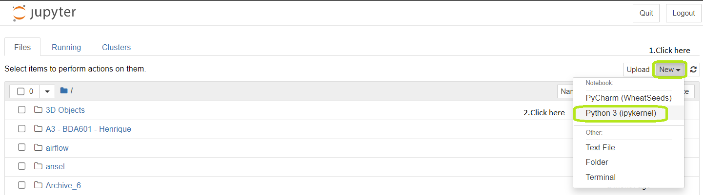

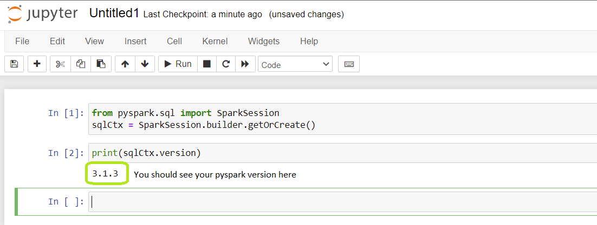

