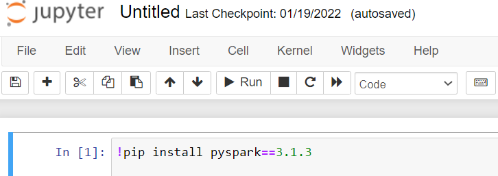
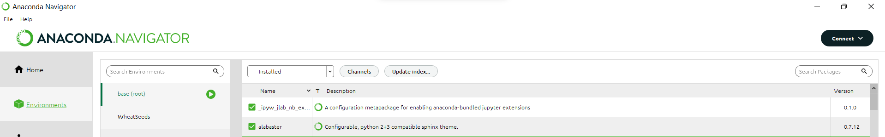

# Installations
Installation approches

### In this repository you can find installation approach for required library and packages for machine learning and data science projects. 

1. Install packages using command prompt 

From the start open the command prompt (cmd) and run `pip3 install <your package name>`

2. Install packages in the jupyter-notebook 

3. Install packages using the anaconda environment

We’re using Discussions as a place to connect with other members of our community. We hope that you:

- Ask questions you’re wondering about.
- Share ideas.
- Engage with other community members.
- Welcome others and are open-minded. Remember that this is a community we
build together 💪.
To get started: https://github.com/Shazisaremi/Installations/discussions
