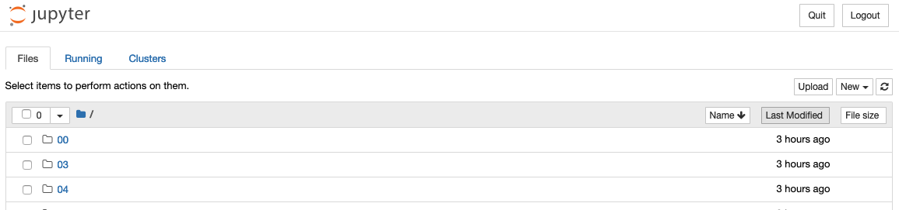

## Installing the classic Jupyter Notebook interface

This section includes instructions on how to get started with Jupyter Notebook. But there are multiple Jupyter user interfaces one can use, based on their needs. Please checkout the list and links below for additional information and instructions about how to get started with each of them.

This information explains how to install the Jupyter Notebook and the IPython kernel.\

### Prerequisite: Python

While Jupyter runs code in many programming languages, Python is a requirement (Python 3.3 or greater, or Python 2.7) for installing the Jupyter Notebook.

We recommend using the [Anaconda](https://www.anaconda.com/products/distribution) distribution to install Python and Jupyter. We’ll go through its installation in the next section.

## Installing Jupyter using Anaconda and conda

For new users, we **highly recommend** [installing Anaconda](https://www.anaconda.com/products/distribution). Anaconda conveniently installs Python, the Jupyter Notebook, and other commonly used packages for scientific computing and data science.

Use the following installation steps:

* Download [Anaconda](https://www.anaconda.com/products/distribution). We recommend downloading Anaconda’s latest Python 3 version (currently Python 3.9).

* Install the version of Anaconda which you downloaded, following the instructions on the download page.

* Congratulations, you have installed Jupyter Notebook. To run the notebook:

## Getting started with Anaconda

Anaconda Distribution contains conda and Anaconda Navigator, as well as Python and hundreds of scientific packages. When you installed Anaconda, you installed all these too.

Conda works on your command line interface such as Anaconda Prompt on Windows and terminal on macOS and Linux.

Navigator is a desktop graphical user interface that allows you to launch applications and easily manage conda packages, environments, and channels without using command-line commands.

## Your first Python program: Hello, Anaconda!
Use Anaconda Navigator to launch an application. Then, create and run a simple Python program with **Jupyter Notebook**.

### Open Navigator
Choose the instructions for your operating system: 

#### Windows:
From the Start menu, click the Anaconda Navigator desktop app.

#### macOS:
Open Launchpad, then click the Anaconda Navigator icon.

#### Linux:
Open a terminal window and type `anaconda-navigator`.

### Run Python in a Jupyter Notebook

1- On Navigator’s Home tab, in the Applications pane on the right, scroll to the Jupyter Notebook tile and click the Install button to install Jupyter Notebook.

> **Note:**
> 
> On Navigator’s Home tab, in the Applications pane on the right, scroll to the Jupyter Notebook tile and click the Install button to install Jupyter Notebook.

2- Launch Jupyter Notebook by clicking Jupyter Notebook’s Launch button.
This will launch a new browser window (or a new tab) showing the Notebook Dashboard.

3- On the top of the right hand side, there is a dropdown menu labeled “New”. Create a new Notebook with the Python version you installed.

4- Rename your Notebook. Either click on the current name and edit it or find rename under File in the top menu bar. You can name it to whatever you’d like, but for this example we’ll use MyFirstAnacondaNotebook.

5- In the first line of the Notebook, type or copy/paste `print("Hello Anaconda")`.

6- Save your Notebook by either clicking the save and checkpoint icon or select File - Save and Checkpoint in the top menu.

7- Run your new program by clicking the Run button or selecting Cell - Run All from the top menu.

### Close Jupyter Notebook
1- From Jupyter Notebooks top menu bar, select File - Close and Halt.

2- Click the Quit button at the upper right of the Notebook Dashboard and close the window or tab.
### Close Navigator
From Navigator’s top menu bar, select Anaconda Navigator - Quit Anaconda-Navigator.